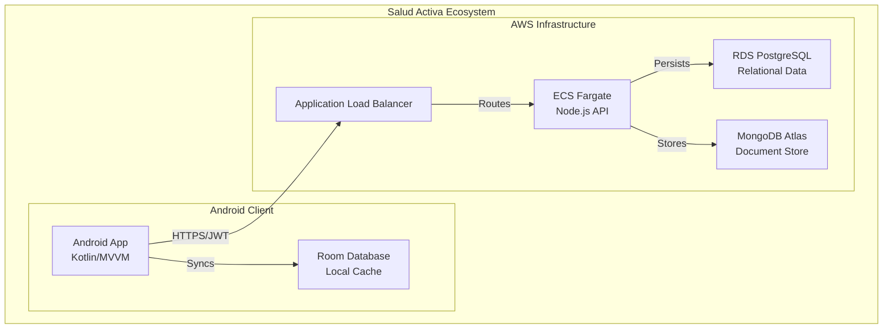

# Technical Documentation: Salud Activa Project

This document serves as the master technical reference for the **Salud Activa** ecosystem, encompassing the Android application, Node.js backend, and AWS infrastructure.

---

## 1. Architectural Decision Record: ADR-001

*   **Title:** Documentation Language
*   **ID:** ADR-001
*   **Date:** 2024-01-10
*   **Status:** Accepted
*   **Authors:** Maria Garcia — Tech Lead

### Context
The software industry standard—Stack Overflow, library documentation, technical articles, frameworks, and open-source tooling—operates in English. Mixing languages across artifacts (e.g., Spanish documentation vs. English code) creates a cognitive translation boundary that slows onboarding, increases naming errors, and makes it harder to search for technical help online.

### Decision
**Alternative A:** Use English for all documentation and code.
*   **Code:** Variables, functions, and classes in English for consistency with libraries.
*   **Database:** Table and column names in English for ORM mapping coherence.
*   **Git:** Commits (Conventional Commits) and branch names in English.
*   **Documentation:** All Markdown files and technical guides in English to eliminate translation boundaries.
*   **API:** OpenAPI contracts and endpoint descriptions in English for accessibility.
*   **Logs:** Internal system logs and monitoring metrics in English to facilitate troubleshooting.

### Consequences
*   **Positive:** A single language across all artifacts eliminates the translation boundary and aligns the project with global industry standards.
*   **Negative:** Team members less confident in English may need initial support or a domain glossary for business-specific terms.

---

## 2. System Architecture Overview

### 2.1. Adopted Architectural Style
**Style:** Modular Monolith / Clean Architecture.
**Justification:** This approach ensures a strict separation between business logic and infrastructure. By using a modular monolith approach with Clean Architecture, we maintain high testability and the ability to extract features into microservices in the future without modifying core business rules.

### 2.2. C4 Diagram — System Level (Context)

```
┌─────────────────────────────────────────────────────────────────────┐
│                        Salud Activa System                          │
│                                                                     │
│  ┌─────────────┐    ┌─────────────┐    ┌────────────────────────┐  │
│  │ Android App │    │ Backend API │    │ External Services      │  │
│  │             │    │             │    │ (FCM, AWS RDS)         │  │
│  │ Kotlin/Room │    │ Node/Express│    │                        │  │
│  └──────┬──────┘    └──────┬──────┘    └──────────┬─────────────┘  │
│         │                  │                       │                │
│         └──────────────────┴───────────────────────┘                │
│                            │ REST API / HTTPS                       │
└────────────────────────────│────────────────────────────────────────┘
                             │
                  ┌──────────┴──────────┐
                  │                     │
         ┌────────▼──────┐    ┌─────────▼────────┐
         │ API Gateway   │    │ Admin Dashboard  │
         │ (AWS ALB)     │    │ (Future Release) │
         └────────┬──────┘    └──────────────────┘
                  │
         ┌────────▼──────────────┐
         │    External clients   │
         │  (Mobile App Users)   │
         └───────────────────────┘
```

### 2.3. C4 Diagram — Container Level



### 2.4. Service Catalog
*   **Android App:** Responsible for UI, local business logic, and offline synchronization. Uses Room for local persistence.
*   **Backend API:** Responsible for authentication, appointment management, and PII storage. Built with Node.js/Express.
*   **Infrastructure:** Infrastructure as Code (IaC) using Terraform for AWS resources (ECS, RDS, Load Balancers).

### 2.5. Architectural Principles
*   **P1 (API-First):** Design API contracts (OpenAPI) before implementation.
*   **P2 (Offline-First):** The Android app remains functional without connectivity via local Room caching.
*   **P3 (Fail Fast):** Detect errors early through strict validation at the API and Domain levels.
*   **P4 (Observability):** Structured JSON logging and CloudWatch metrics are mandatory.

---

## 3. User Stories (Functional Requirements)

### HU-IAM-001: User Authentication (Login)
**Story:** As an application user, I want to enter my credentials so that I can access my medical data securely.
*   **AC1:** Redirect to HomeFragment on success and store the JWT securely.
*   **AC2:** Auto-login if a valid token exists in EncryptedSharedPreferences.
*   **AC3:** Show an "Invalid credentials" error on failed attempts.

### HU-SCHED-001: Medical Appointment Request
**Story:** As a patient, I want to select a specialty and date so that I can schedule a medical appointment online.
*   **AC1:** Display a summary for confirmation before final submission.
*   **AC2:** Synchronize with the server immediately if the device is online.
*   **AC3:** Save locally and mark for background sync if the device is offline.

---

## 4. Non-Functional Requirements (NFR)

### 4.1. Performance
*   **P95 Latency — Critical Endpoints:** < 300ms under 100 RPS load.
*   **Android App Cold Start:** < 2 seconds on mid-range devices.
*   **Service Startup Time:** < 20 seconds for AWS Fargate cold starts.

### 4.2. Availability
*   **Production SLO:** 99.9% monthly availability.
*   **Maintenance Window:** Sundays 2am-4am.
*   **Health Checks:** Standardized `GET /api/status` for monitoring.

### 4.3. Security
*   **Authentication:** Mandatory JWT in the Authorization header (1h expiry).
*   **Transmission:** HTTPS mandatory in production via TLS 1.2 or higher.
*   **Android Security:** Encrypted local storage and Biometric protection for app access.

### 4.4. Maintainability
*   **Test Coverage:** Minimum 80% coverage in business logic (ViewModels and Repositories).
*   **CI Build Time:** < 6 minutes on GitHub Actions.

---

## 5. Hexagonal Architecture Guide

### 5.1. The Concept
Hexagonal architecture (Ports & Adapters) ensure the business domain is independent of surrounding technology. 
*   **Domain:** The core hexagon. No frameworks allowed. Contains Entities, Value Objects, and Ports (interfaces).
*   **Application:** Use cases that orchestrate the domain logic.
*   **Infrastructure:** Adapters (Controllers, Repositories, API Clients).

### 5.2. Folder Structure
*   **domain/:** Aggregate roots, value objects, and Ports (contracts).
*   **application/:** Use case implementations and DTOs.
*   **infrastructure/:** Technical adapters (Retrofit, Room, Express).

### 5.3. The Dependency Rule
Dependencies always point inward: **Infrastructure -> Application -> Domain**. The Domain layer must never import anything from external layers or frameworks.

---

## 6. Disaster Recovery (DR)

| Scenario | RTO (Recovery Time) | RPO (Data Loss Window) |
|---------|---------------------|------------------------|
| Backend Instance Failure | < 2 minutes (ECS Auto-restart) | 0 (Stateless) |
| DB Failure (RDS/Atlas) | < 5 minutes (Failover to replica) | < 5 seconds |
| Regional Disaster | < 4 hours (Full AWS Redeploy) | < 1 hour |

---

## 7. ADR Template for Future Decisions

*   **ID:** ADR-NNN
*   **Date:** YYYY-MM-DD
*   **Status:** Proposed | Accepted | Rejected
*   **Authors:** [Names]

### Context
Describe the situation that requires a decision. Why is this important? What are the technical or business constraints?

### Decision
Provide a clear description of the chosen path and the justification for why this option is the best fit.

### Consequences
*   **Positive:** Benefits gained from this decision.
*   **Negative:** Costs, trade-offs, or new limitations.
*   **Impact:** Affected services and documents to be updated.
