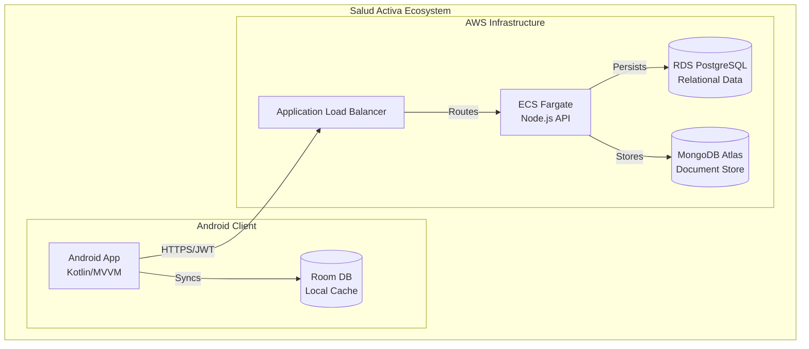
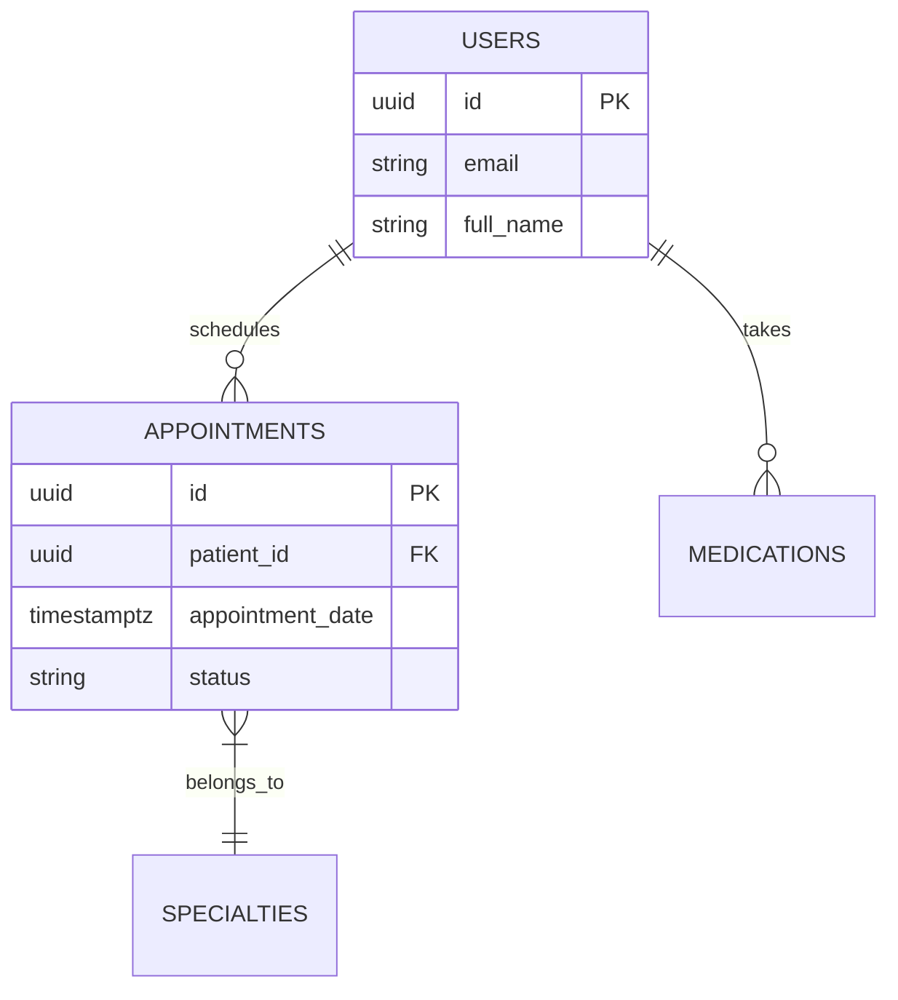

# Technical Master Documentation: Salud Activa Project

This document is the definitive technical reference for the Salud Activa ecosystem, covering the Android application, Node.js backend, and AWS infrastructure.

---

## 1. Architectural Decision Records (ADR)

### ADR-001: Documentation and Code Language
*   **ID:** ADR-001
*   **Status:** Accepted
*   **Date:** 2024-01-10
*   **Authors:** Maria Garcia — Tech Lead
*   **Decision:** All technical artifacts (code, documentation, database schemas, and git history) will be in **English**.
*   **Justification:** Eliminates the cognitive translation boundary, aligns with the global software ecosystem, and facilitates the use of AI tools and external contributors.

---

## 2. System Architecture Overview

### 2.1. Adopted Architectural Style
**Style:** Modular Monolith / Clean Architecture.
**Justification:** Ensures strict separation between business logic and delivery mechanisms (UI, DB, API). This allows the project to scale without rewriting core business rules.

### 2.2. C4 Diagram — System Level (Context)

```mermaid
graph LN
  User((Patient/User))
  SaludActiva[Salud Activa System]
  FCM[Firebase Cloud Messaging]
  AWS[AWS Cloud Services]

  User -- Uses --> SaludActiva
  SaludActiva -- Sends Notifications --> FCM
  FCM -- Delivers to --> User
  SaludActiva -- Deployed on --> AWS
```

### 2.3. C4 Diagram — Container Level



### 2.4. Service Catalog
*   **android-app:** Kotlin native app. Handles UI, local business logic, and offline-first synchronization using Room.
*   **backend-api:** Node.js/Express service. Orchestrates Authentication, Appointments, and Records.
*   **terraform-infra:** Infrastructure as Code for AWS (ALB, ECS, RDS).

---

## 3. Data Models per Service

### 3.1. Modeling Principles
*   **Database per Service:** No shared database access.
*   **Standard Audit:** All tables include `id` (UUID), `created_at`, `updated_at`, and `deleted_at` (Soft Delete).

### 3.2. Relationship Diagram



---

## 4. Functional Requirements (User Stories)

### HU-IAM-001: Secure Login
**As** a user, **I want** to log in with email/password **so that** I can access my medical history.
*   **AC1:** Securely store JWT in EncryptedSharedPreferences.
*   **AC2:** Support biometric bypass if a valid session exists.

### HU-SCHED-001: Appointment Scheduling
**As** a patient, **I want** to book an appointment **so that** I can see a doctor.
*   **AC1:** Allow offline booking with background sync via SyncWorker.

---

## 5. Non-Functional Requirements (NFR)

*   **Performance:** P95 Latency < 300ms for API calls. App cold start < 2s.
*   **Availability:** 99.9% uptime for the Backend API.
*   **Security:** TLS 1.2+ mandatory. JWT tokens expire in 1 hour. PII encrypted at rest.
*   **Maintainability:** >80% code coverage. CI pipeline < 6 minutes.

---

## 6. Hexagonal Architecture Guide

### 6.1. The Dependency Rule
**Dependencies always point inward: Infrastructure → Application → Domain.**
*   **Domain:** Contains Entities and Ports (Interfaces). No frameworks allowed.
*   **Application:** Implements Driving Ports (Use Cases).
*   **Infrastructure:** Implements Driven Ports (Repositories, API Clients).

---

## 7. Design Patterns and Microservices Guide

### 7.1. Resilience Patterns
*   **Circuit Breaker:** Applied to Backend → FCM communication to prevent cascading failures.
*   **Retry with Backoff:** Used in the Android SyncWorker for transient network errors.

### 7.2. Data Consistency
*   **Outbox Pattern:** Ensures database updates and event publications are atomic.
*   **CQRS:** Segregates the write model (Commands) from the read model (Queries).

---

## 8. Disaster Recovery (DR)

| Scenario | RTO (Recovery Time) | RPO (Data Loss Window) |
|---------|---------------------|------------------------|
| Backend Failure | < 2 minutes (ECS Auto-restart) | 0 (Stateless) |
| DB Failure (RDS/Atlas) | < 5 minutes (Failover) | < 5 seconds |
| Regional Disaster | < 4 hours (Full AWS Redeploy) | < 1 hour |
