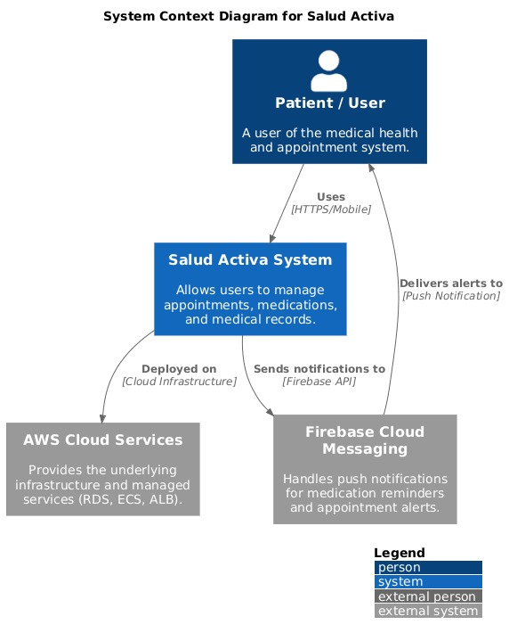
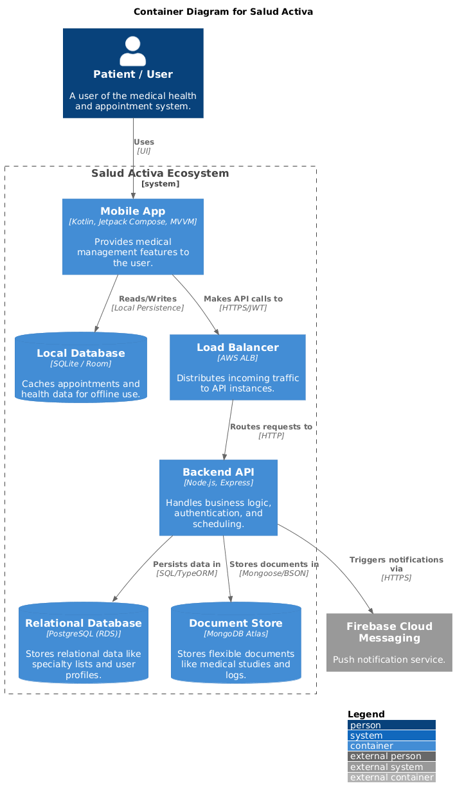

# System Architecture Overview

# Technical Documentation: Salud Activa Project

This document serves as the master technical reference for the Salud Activa ecosystem, encompassing the Android application, Node.js backend, and AWS infrastructure.

---

## 1. Architectural Decision Record: ADR-001

**Title:** Documentation Language
**ID:** ADR-001
**Date:** 2024-01-10
**Status:** Accepted
**Authors:** Maria Garcia — Tech Lead

### Context

The software industry standard—Stack Overflow, library documentation, technical articles, frameworks, and open-source tooling—operates in English. Mixing languages across artifacts (e.g., Spanish documentation vs. English code) creates a cognitive translation boundary that slows onboarding, increases naming errors, and makes it harder to search for technical help online.

### Decision
We decided to use English for all documentation and code. This includes:
*   Code: Variable names, functions, and classes.
*   Database: Table and column names.
*   Git: Commits following the Conventional Commits standard and branch names.
*   Documentation: All Markdown files and technical guides.
*   API: OpenAPI contracts and endpoint descriptions.
*   Logs: Internal system logs and monitoring metrics.

### Consequences
*   Positive: A single language across all artifacts eliminates the translation boundary and aligns the project with global industry standards.
*   Negative: Team members less confident in English may need initial support or a domain glossary for business-specific terms.

---

## 2. System Architecture Overview

### Adopted Architectural Style
**Style:** Modular Monolith / Clean Architecture.
**Justification:** This approach ensures a strict separation between business logic and infrastructure. By using a modular monolith approach with Clean Architecture, we maintain high testability and the ability to extract features into microservices in the future without modifying core business rules.

### C4 Diagram — System Level (Context)

### C4 Diagram — Container Level

*   Android Client: Contains the Kotlin/MVVM App and Room Database (Local Cache).
*   AWS Infrastructure: Includes an Application Load Balancer (ALB), ECS Fargate (Node.js API), RDS PostgreSQL (Relational Data), and MongoDB Atlas (Document Store).
*   Communication: App communicates with ALB via HTTPS/JWT. ECS persists to RDS and stores documents in MongoDB. App syncs data to LocalDB.

### Service Catalog
*   Android App: Responsible for UI, local business logic, and offline synchronization. Uses Room for local persistence. Communication via REST and FCM.
*   Backend API: Responsible for authentication, appointment management, and PII storage. Built with Node.js/Express. Uses MongoDB and PostgreSQL.
*   Infrastructure: Managed via Terraform for AWS resources (ECS, RDS, Load Balancers).

### Architectural Principles
*   P1 (API-First): Design API contracts before implementing service logic.
*   P2 (Offline-First): The app remains functional without connectivity via local Room caching.
*   P3 (Fail Fast): Detect errors early through strict validation at the API and Domain levels.
*   P4 (Observability): Structured JSON logging and CloudWatch metrics are mandatory.

---

## 3. User Stories (Functional Requirements)

### HU-IAM-001: User Authentication (Login)
**Story:** As an application user, I want to enter my credentials so that I can access my medical data securely.
*   AC1: Redirect to HomeFragment on success and store the JWT securely.
*   AC2: Auto-login if a valid token exists in EncryptedSharedPreferences.
*   AC3: Show an "Invalid credentials" error on failed attempts.

### HU-SCHED-001: Medical Appointment Request
**Story:** As a patient, I want to select a specialty and date so that I can schedule a medical appointment online.
*   AC1: Display a summary for confirmation before final submission.
*   AC2: Synchronize with the server immediately if the device is online.
*   AC3: Save locally and mark for background sync if the device is offline.

### HU-MED-001: Medication Registration and Scanning
**Story:** As a patient, I want to scan barcodes or enter medications manually so that I receive intake alerts.
*   AC1: Auto-populate fields using the MedicineScanner utility.
*   AC2: Trigger high-priority notifications via the NotificationHelper.

---

## 4. Non-Functional Requirements (NFR)

### Performance
*   Critical Endpoints Latency: P95 less than 300ms under 100 RPS load.
*   Android App Cold Start: Less than 2 seconds on mid-range devices.
*   Service Startup Time: Less than 20 seconds for AWS Fargate cold starts.

### Availability
*   Production SLO: 99.9% monthly availability.
*   Maintenance Window: Sundays 2am-4am.
*   Health Checks: Standardized GET /api/status for liveness monitoring.

### Security
*   Authentication: Mandatory JWT in the Authorization header (1h expiry).
*   Transmission: HTTPS mandatory in production via TLS 1.2 or higher.
*   Android Security: Encrypted local storage for tokens and Biometric protection.

### Maintainability
*   Test Coverage: Minimum 80% coverage in business logic layers.
*   CI Build Time: Less than 6 minutes on GitHub Actions.
*   Onboarding: Local environment setup in less than 1 hour.

---

## 5. Hexagonal Architecture Guide

### The Concept
Hexagonal architecture (Ports and Adapters) ensures the business domain is completely independent of surrounding technology. 
*   Domain: The core hexagon containing Entities, Value Objects, and Ports (interfaces).
*   Application: Use cases that orchestrate domain logic.
*   Infrastructure: Adapters including HTTP controllers, database implementations, and API clients.

### The Dependency Rule
Dependencies always point inward: **Infrastructure -> Application -> Domain**. The Domain layer must never import anything from external layers or frameworks like Retrofit, Room, or Express.

---

## 6. Disaster Recovery (DR)

### Recovery Scenarios
*   Backend Instance Failure: Recovery time (RTO) less than 2 minutes via ECS Auto-restart. Data loss (RPO) is zero due to stateless design.
*   Database Failure: Recovery time less than 5 minutes via failover to a replica. Data loss window (RPO) less than 5 seconds.
*   Regional Disaster: Recovery time less than 4 hours for full AWS redeploy. Data loss window (RPO) less than 1 hour.

---

## 7. ADR Template for Future Decisions

*   **ID:** ADR-NNN
*   **Date:** YYYY-MM-DD
*   **Status:** Proposed | Accepted | Rejected
*   **Authors:** [Names]

### Context
Describe the situation that requires a decision. What are the technical or business constraints?

### Decision
Provide a clear description of the chosen path.
*   Justification: Explain why this option is the best fit.

### Evaluated Alternatives
*   Alternative A (Chosen): Pros and cons.
*   Alternative B: Pros, cons, and why it was discarded.

### Consequences
*   Positive: Benefits gained.
*   Negative: Costs, trade-offs, or new limitations.
*   Impact: List affected services and documents to be updated.