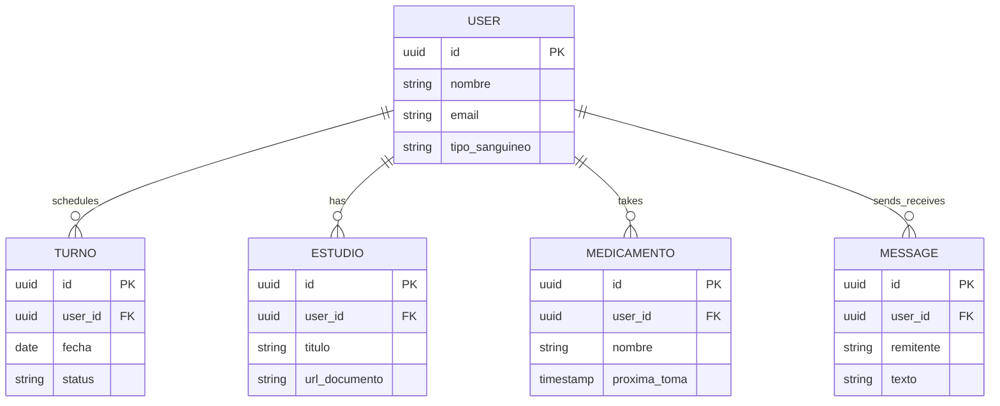

# Data Models per Service

This document centralizes the data schema for each service of the **GestionTurnosApp** ecosystem. Each service manages its own persistence layer following the principles of encapsulation and high cohesion.

---

## Data modeling principles

### 1. Database per Service (mandatory)
No service directly accesses another service's database. Communication is performed via REST API or asynchronous events (FCM/WebSockets).

### 2. Standard audit fields
All tables/documents include:
- `id`: UUID (Primary Key)
- `created_at`: TIMESTAMP (Auto-generated)
- `updated_at`: TIMESTAMP (Auto-updated)
- `deleted_at`: TIMESTAMP (Nullable for soft delete)

### 3. Soft delete by default
Records are never physically deleted. The `deleted_at` field is used to filter active records.

### 4. Naming conventions
- **Tables/Collections:** `snake_case`, plural.
- **Columns/Fields:** `snake_case`.
- **Foreign Keys:** `referenced_table_id`.

---

## Service: Identity & Profile Service

**DB Engine:** MongoDB 7 (Scalability and flexibility for user profiles)

**Engine justification:**
- High flexibility for evolving user profiles (allergies, medical conditions).
- Native support for JSON-like structures which aligns with the mobile DTOs.

### Table: users

**Purpose:** Stores authentication data and basic medical profile information.

```sql
CREATE TABLE users (
  id              UUID        PRIMARY KEY DEFAULT gen_random_uuid(),
  
  -- Auth fields
  nombre          VARCHAR(255) NOT NULL,
  email           VARCHAR(255) UNIQUE NOT NULL,
  contrasena      VARCHAR(255) NOT NULL,
  
  -- Verification
  is_verified     BOOLEAN      DEFAULT FALSE,
  verification_code VARCHAR(10) DEFAULT NULL,
  fcm_token       TEXT         DEFAULT NULL,
  
  -- Medical Profile
  telefono        VARCHAR(20),
  tipo_sanguineo  VARCHAR(5),
  alergias        TEXT,
  condiciones     TEXT,
  contacto_emergencia TEXT,
  
  -- Audit
  created_at      TIMESTAMPTZ NOT NULL DEFAULT NOW(),
  updated_at      TIMESTAMPTZ NOT NULL DEFAULT NOW(),
  deleted_at      TIMESTAMPTZ
);

CREATE INDEX idx_users_email ON users (email);
```

---

## Service: Appointment (Turno) Service

**DB Engine:** PostgreSQL 15 (Consistency and ACID for scheduling)

**Engine justification:**
- PostgreSQL ensures that no two appointments overlap for the same resource via constraints.
- Transactional integrity is critical for booking.

### Table: turnos

**Purpose:** Manages the lifecycle of medical appointments.

```sql
CREATE TABLE turnos (
  id              UUID        PRIMARY KEY DEFAULT gen_random_uuid(),
  user_id         UUID        NOT NULL, -- Reference to Identity Service
  
  -- Business fields
  paciente_nombre VARCHAR(255) NOT NULL,
  fecha           DATE         NOT NULL,
  hora            TIME         NOT NULL,
  motivo          VARCHAR(255) DEFAULT 'General',
  especialidad    VARCHAR(100) DEFAULT 'General',
  doctor          VARCHAR(255) DEFAULT 'Dr. Asignado',
  
  -- Status
  status          VARCHAR(50)  NOT NULL DEFAULT 'PENDIENTE'
                  CHECK (status IN ('PENDIENTE', 'CONFIRMADO', 'CANCELADO', 'COMPLETADO')),
  
  -- Audit
  created_at      TIMESTAMPTZ NOT NULL DEFAULT NOW(),
  updated_at      TIMESTAMPTZ NOT NULL DEFAULT NOW(),
  deleted_at      TIMESTAMPTZ
);

CREATE INDEX idx_turnos_user_id ON turnos (user_id);
CREATE INDEX idx_turnos_fecha ON turnos (fecha);
```

---

## Service: Medical Records Service

**DB Engine:** MongoDB 7 (Document-based for varying attachment types)

### Table: estudios (Studies/Exams)

**Purpose:** Records medical studies, exam results, and document links.

```sql
CREATE TABLE estudios (
  id              UUID        PRIMARY KEY DEFAULT gen_random_uuid(),
  user_id         UUID        NOT NULL,
  
  titulo          VARCHAR(255) NOT NULL,
  fecha           DATE         NOT NULL,
  tipo            VARCHAR(100) DEFAULT 'General',
  resultado_breve TEXT,
  url_documento   TEXT,
  notas           TEXT,
  
  -- Audit
  created_at      TIMESTAMPTZ NOT NULL DEFAULT NOW(),
  updated_at      TIMESTAMPTZ NOT NULL DEFAULT NOW(),
  deleted_at      TIMESTAMPTZ
);
```

### Table: medicamentos (Medications)

**Purpose:** Tracks active prescriptions and intake schedules.

```sql
CREATE TABLE medicamentos (
  id              UUID        PRIMARY KEY DEFAULT gen_random_uuid(),
  user_id         UUID        NOT NULL,
  
  nombre          VARCHAR(255) NOT NULL,
  dosis           VARCHAR(100) NOT NULL,
  frecuencia      VARCHAR(100) NOT NULL,
  proxima_toma    TIMESTAMPTZ  NOT NULL,
  notas           TEXT,
  
  -- Audit
  created_at      TIMESTAMPTZ NOT NULL DEFAULT NOW(),
  updated_at      TIMESTAMPTZ NOT NULL DEFAULT NOW(),
  deleted_at      TIMESTAMPTZ
);
```

---

## Service: Communication Service

**DB Engine:** Redis 7 / MongoDB 7

### Table: messages

**Purpose:** Stores chat history between patients and the medical center.

```sql
CREATE TABLE messages (
  id              UUID        PRIMARY KEY DEFAULT gen_random_uuid(),
  user_id         UUID        NOT NULL,
  
  remitente       VARCHAR(20)  NOT NULL CHECK (remitente IN ('PACIENTE', 'DOCTOR')),
  texto           TEXT         NOT NULL,
  leido           BOOLEAN      DEFAULT FALSE,
  
  -- Audit
  created_at      TIMESTAMPTZ NOT NULL DEFAULT NOW(),
  deleted_at      TIMESTAMPTZ
);
```

---

## Relationship diagram



---

## Migration strategy

**Tool:** Liquibase (for SQL services) / Mongoose Migrations (for MongoDB)

**File naming convention:**
`V{version_number}__{description}.sql` / `V{version_number}__{description}.js`

**Rules:**
1. Migrations are **always forward-only**.
2. **Soft Delete logic** must be included in all queries/views.
3. **No hard drops** of columns in production without a deprecation phase.
